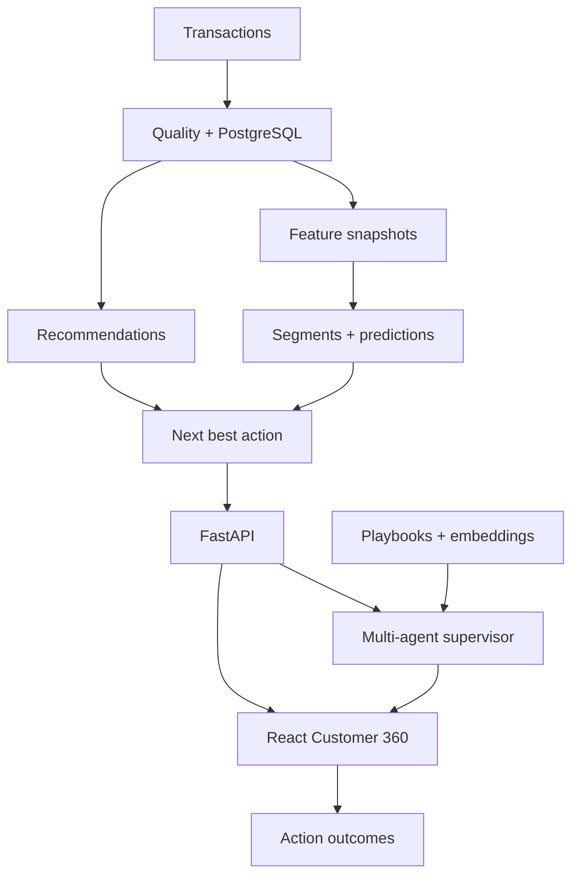

# GrowthPilot AI

End-to-end sales and customer-intelligence copilot for small and medium retailers.

GrowthPilot turns raw transactions into customer state, predictive scores, product recommendations, a prioritized next best action, and a grounded explanation. This repository implements the full portfolio system from ingestion through deployment.

## What is included

- deterministic UCI Online Retail II download, ingestion, cleaning, rejection reasons, quality gates, and EDA;
- normalized PostgreSQL schema, Alembic migrations, chunked idempotent loading, and SQLite demo support;
- leakage-safe customer snapshots with RFM, behavioral windows, trends, baskets, returns, and purchase intervals;
- stable K-Means segmentation with automatic cluster selection and business-readable names;
- temporal churn and 30-day propensity training with F1, precision, recall, ROC-AUC, PR-AUC, and confusion matrices;
- XGBoost when the full extra is installed, with a scikit-learn gradient-boosting fallback for lightweight setups;
- hybrid item-item, segment, and popularity recommendations with leave-last-order-out evaluation;
- next-best-action decision engine and action/outcome feedback tracking;
- ContextOps-inspired multi-agent copilot with a supervisor, safe analytics/Customer 360/RAG
  specialists, Gemini/Ollama failover, grounding validation, one repair pass, citations, and traces;
- FastAPI/OpenAPI backend and React/Vite/TanStack Query/Recharts dashboard;
- Docker Compose, CI, deployment blueprint, tests, documentation, and Git-safe data handling.

## Architecture



The application is a modular monolith: training is offline, approved artifacts are loaded for scoring, and one API exposes stable product contracts. Structured facts stay in PostgreSQL; vector retrieval is used only for semantic knowledge.

## Five-minute demo on Windows

Use Python 3.11+ and Node 20+ from the extracted repository root:

```powershell
Set-ExecutionPolicy -Scope Process -ExecutionPolicy Bypass
.\scripts\setup_demo.ps1
python -m growthpilot serve
```

Open a second PowerShell terminal:

```powershell
cd frontend
npm install
npm run dev
```

Open `http://localhost:5173`. API docs are at `http://localhost:8000/docs`.

The Copilot works without an external model. To enable model-generated synthesis, copy
`.env.example` to `.env`, set `LLM_PROVIDER=gemini` and `GEMINI_API_KEY`, then restart the backend.
See [Multi-agent Copilot](docs/MULTI_AGENT_COPILOT.md).

The setup script generates a clearly labeled synthetic dataset, runs Phase 1, migrates a local SQLite database, loads transactions, creates the current feature snapshot, and trains all models. It does not require PostgreSQL or external AI credentials.

## Manual quick start

```bash
python -m venv .venv
source .venv/bin/activate                 # Windows: .venv\Scripts\activate
python -m pip install -e ".[dev]"        # portable local stack
# python -m pip install -e ".[dev,ml]"   # add XGBoost and SHAP
# python -m pip install -e ".[dev,full]" # also add Sentence Transformers

export DATABASE_URL="sqlite+pysqlite:///growthpilot.db"
python -m growthpilot demo-data
python -m growthpilot phase1 --input data/demo/demo_transactions.csv
python -m growthpilot db-upgrade
python -m growthpilot load-db
python -m growthpilot build-features --as-of "2011-12-09T23:59:59"
python -m growthpilot train-all
python -m growthpilot serve
```

Do not run the bare `growthpilot` command until the virtual environment is activated and the package is installed. `python -m growthpilot` is the most reliable form on Windows.

## Run with UCI Online Retail II

The complete source workbook is intentionally not committed because GitHub rejects large files and dataset licensing should remain with the publisher.

```bash
python -m growthpilot download
python -m growthpilot phase1 --input data/raw/online_retail_II.xlsx
python -m growthpilot db-upgrade
python -m growthpilot load-db
python -m growthpilot build-features --as-of "2011-12-09T12:50:00"
python -m growthpilot train-all
```

The repository contains `data/demo/demo_transactions.csv` for an immediate reproducible walkthrough and `data/sample/online_retail_sample.csv` for edge-case tests. Synthetic metrics must not be presented as real-world model performance.

## CLI

| Command | Outcome |
| --- | --- |
| `demo-data` | Generate deterministic synthetic demo transactions |
| `download` | Download and validate the official UCI archive/workbook |
| `phase1` | Clean data, reconcile totals, enforce quality gates, generate EDA |
| `db-upgrade` | Apply all Alembic migrations |
| `load-db` | Idempotently load canonical transactions |
| `build-features --as-of …` | Create a cutoff-safe feature snapshot |
| `train-all` | Train/evaluate segments, churn, propensity, recommendations, and score customers |
| `serve` | Run the FastAPI application |

## API and UI

The API includes dashboard summary, customer directory, Customer 360, segments, opportunities, model performance, actions, and copilot routes. See [API.md](docs/API.md).

The UI contains the executive dashboard, customer directory, Customer 360, behavioral segments, ranked opportunities, GrowthPilot Copilot, and model-health pages.

## ML contracts

- Churn: no purchase in `(T, T+90 days]`.
- Propensity: at least one purchase in `(T, T+30 days]`.
- Features: only transactions at or before cutoff `T`.
- Evaluation: earlier cutoffs train, later cutoffs validate, latest cutoffs test.
- Recommendations: held-out last order is never used to fit its evaluation model.
- Segment selection: combined silhouette quality and repeated-seed stability.

Model artifacts carry feature names, threshold, version, training bounds, parameters, and metrics. Runtime binary artifacts are ignored by Git because they are reproducible and environment-dependent; JSON model metadata and training code are retained.

## Repository map

```text
growthpilot-ai/
├── frontend/                   React analytics application
├── src/growthpilot/
│   ├── api/                    FastAPI routes and schemas
│   ├── agents/                 supervisor, specialists, LLM failover, grounding
│   ├── data/                   download, ingestion, cleaning, QA, EDA
│   ├── db/                     SQLAlchemy models, sessions, loader
│   ├── features/               leakage-safe customer features
│   ├── ml/                     snapshots, segmentation, supervised training
│   ├── recommendations/        hybrid recommender
│   ├── decision/               next-best-action policy
│   ├── rag/                    chunking, embeddings, retrieval, copilot
│   └── services/               customer intelligence queries
├── migrations/                 Alembic schema history
├── data/demo/                  Git-safe synthetic demo data
├── artifacts/                  runtime model output locations
├── tests/                      unit and integration tests
├── docs/                       PRD, contracts, architecture, phases, API
├── scripts/                    one-command Bash and PowerShell setup
├── deploy/                     cloud deployment blueprint
├── docker-compose.yml
└── .github/workflows/ci.yml
```

## Verification

```bash
python -m ruff check .
python -m pytest
cd frontend && npm ci && npm run build
```

The end-to-end smoke test should also start from a fresh database, apply migrations, ingest demo data, build features, train every model, and query the health, dashboard, customer, opportunity, copilot, and model-performance endpoints.

## Documentation

- [Product requirements](docs/PHASE_0_PRD.md)
- [Architecture](docs/ARCHITECTURE.md)
- [Data contract](docs/DATA_CONTRACT.md)
- [Database](docs/PHASE_2_DATABASE.md)
- [Features](docs/PHASE_3_FEATURES.md)
- [Phases 4–20](docs/PHASES_4_20.md)
- [API](docs/API.md)
- [Multi-agent Copilot](docs/MULTI_AGENT_COPILOT.md)
- [Deployment](docs/DEPLOYMENT.md)
- [GitHub checklist](docs/GITHUB_CHECKLIST.md)

## Scope and honesty

This is a portfolio-grade decision-support product, not a claim that one retail dataset generalizes to every SME. Before production use, add authentication, tenant isolation, scheduled jobs, monitoring, drift checks, causal campaign evaluation, privacy controls, and human approval for customer-facing actions.

UCI Online Retail II remains subject to its publisher's citation and usage terms. The generated demo data is synthetic. Add your chosen code license before publishing if you want others to reuse the source.
