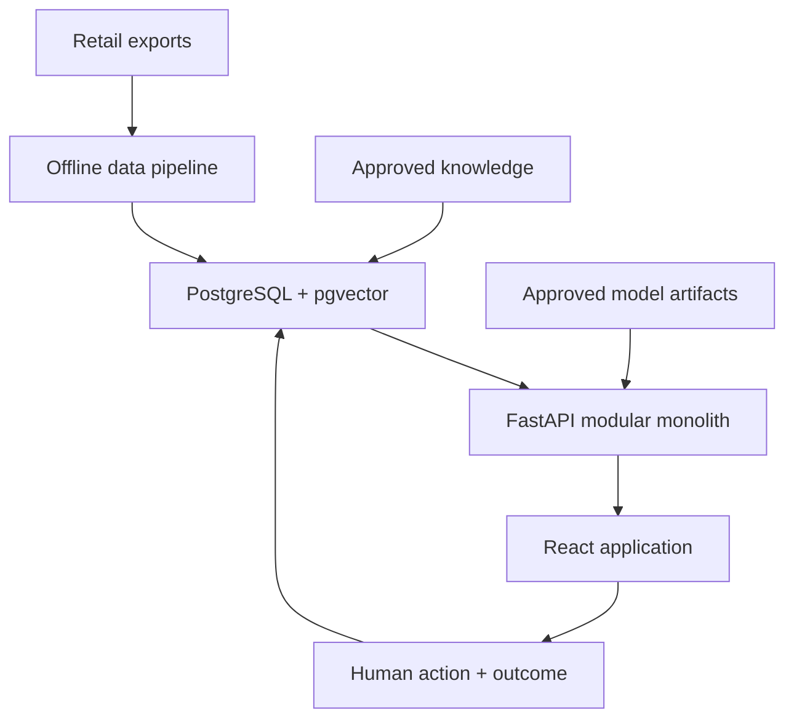
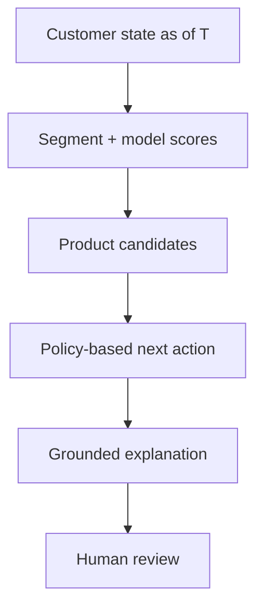
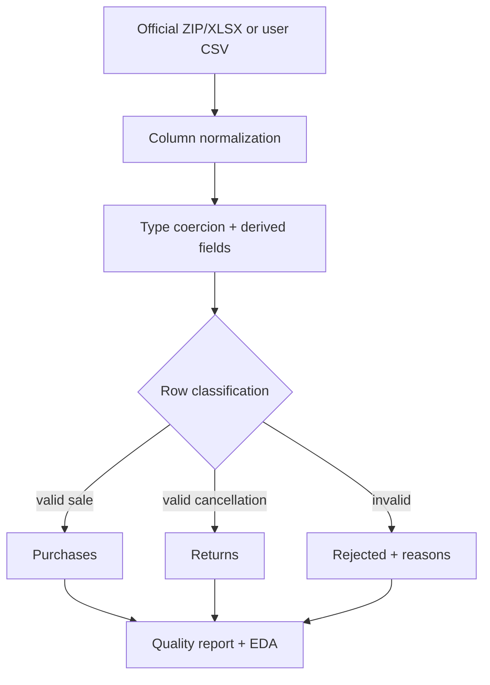

# GrowthPilot Architecture

## System boundary

GrowthPilot starts as a modular monolith with separate offline training jobs. This keeps transactional logic, analytics, model inference, and retrieval independently testable without premature operational complexity.

## Decision path

## Logical modules

| Module | Owns | Does not own |
| --- | --- | --- |
| Ingestion | source parsing, alias normalization, source-row identity | business feature definitions |
| Data quality | row classifications, quality gates, reconciliation | silent repair of invalid facts |
| Features | cutoff-safe customer snapshots | model fitting |
| Training | temporal splits, evaluation, model artifacts | online database writes |
| Scoring | approved artifact loading and prediction | model retraining |
| Decision engine | explicit prioritization/action policy | prose generation |
| Analytics | deterministic metrics and comparisons | semantic document retrieval |
| RAG | knowledge chunking and semantic retrieval | calculating transactional metrics |
| Copilot | intent routing and grounded answer composition | unrestricted database/SQL execution |
| Feedback | actions, statuses, outcomes | retrospectively altering prior scores |

## Phase 1 data flow

## Technology choices

| Concern | Choice | Reason |
| --- | --- | --- |
| Application architecture | FastAPI modular monolith | One Python boundary supports analytics, inference, and RAG while modules remain separable. |
| Operational store | PostgreSQL | Strong relational fit for customers, orders, scores, actions, and audit data. |
| Vector search | pgvector | Avoids a second database and supports exact/HNSW retrieval when needed. |
| Batch data | Pandas + Parquet in later phases | Appropriate dataset scale and transparent transformations. CSV is retained in Phase 1 for zero-extra-engine portability. |
| Classical ML | scikit-learn + XGBoost | Strong tabular baselines, probabilities, and explainability ecosystem. |
| Embeddings | all-MiniLM-L6-v2 adapter | Free local 384-dimensional baseline; provider abstraction prevents lock-in. |
| UI | React + Vite + Tailwind + TanStack Query | Existing team familiarity and productive dashboard stack. |
| Packaging | Docker Compose later | Reproducible local demonstration without Kubernetes overhead. |

## Planned storage model

Core tables: `workspaces`, `users`, `customers`, `products`, `orders`, `order_items`, `customer_feature_snapshots`, `customer_segments`, `model_scores`, `recommendations`, `next_best_actions`, `action_outcomes`, `documents`, `document_chunks`, `copilot_conversations`, and `model_runs`.

Every business table will include `workspace_id`. Time-varying facts carry an `as_of_date` or timestamp plus a feature/model/policy version.

## Copilot safety boundary

The copilot router distinguishes four classes:

1. **Metrics:** call allow-listed parameterized analytics functions.
2. **Customer intelligence:** retrieve a Customer 360 fact bundle and current predictions.
3. **Recommendations:** call the versioned recommendation/decision service.
4. **Knowledge/strategy:** retrieve approved document chunks through pgvector.

The LLM receives bounded facts and sources. It cannot generate and execute arbitrary SQL, send customer messages, or change action status.

## Deferred architecture decisions

- Redis is added only after measurement identifies a caching or job-queue need.
- MLflow is considered when experiments exceed simple file/metadata tracking.
- Services are split only when deployment cadence, scaling, or reliability evidence justifies it.
- No Kafka, Kubernetes, Spark, GraphQL, or agent swarm is in MVP scope.
