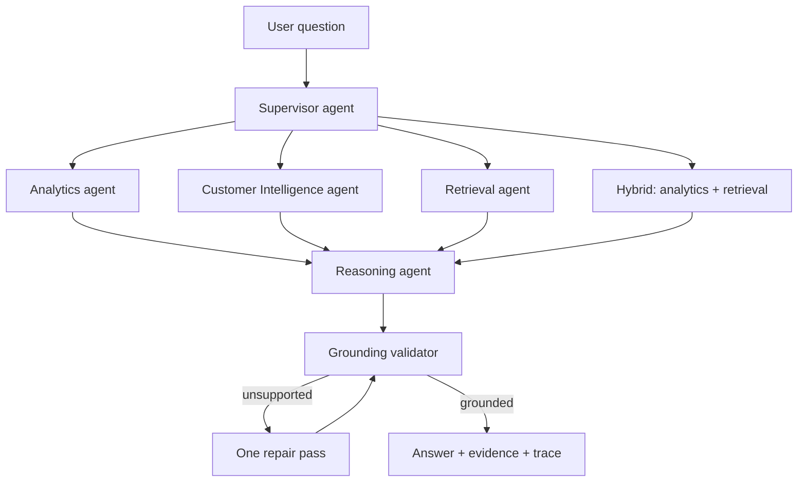

# Multi-agent GrowthPilot Copilot

GrowthPilot 1.1 adapts the proven control-plane ideas from ContextOps to retail customer
intelligence. It does **not** copy ContextOps ticket tables or allow a model to execute arbitrary
SQL. Every specialist receives a narrow, allow-listed GrowthPilot tool.

## Workflow



### Supervisor agent

Common high-confidence requests are routed deterministically so they remain auditable and do not
consume model quota. When wording is ambiguous and a provider is enabled, Gemini or Ollama returns
a typed route decision. A missing or malformed model response falls back safely to knowledge
retrieval.

### Analytics agent

Calls `IntelligenceService.analytics_answer`. The service exposes approved operations for revenue,
segments, countries, churn risk, and sales opportunities. The model never receives database
credentials and never generates executable SQL.

### Customer Intelligence agent

Requires a concrete customer identifier. It retrieves Customer 360, latest segment, churn and
propensity scores, recommendation ranking, explanations, and the policy-based next-best action.

### Retrieval agent

Retrieves semantically ranked chunks from approved sales and retention playbooks. Structured
metrics are never calculated from document embeddings.

### Hybrid path

Questions such as `What retention strategy should we use for high-risk customers?` call both the
analytics and retrieval specialists before synthesis.

### Validator and repair

The deterministic validator checks that numeric claims exist in the supplied evidence and that the
answer has meaningful lexical support. An unsupported answer receives at most one repair pass,
preventing agent loops. The UI exposes the route, specialists, provider, grounding confidence, and
sources.

## Provider modes

| Mode | Behaviour |
| --- | --- |
| `deterministic` | No external model or key; tools return reproducible evidence-backed summaries. |
| `gemini` | Gemini synthesizes bounded evidence; deterministic output remains the fallback. |
| `ollama` | A local Ollama model synthesizes bounded evidence. |
| `hybrid` | Uses the configured primary provider and fails over to the other provider. |

Gemini rate-limit/quota errors open a short circuit breaker so later requests immediately use the
fallback instead of repeatedly waiting on the cloud provider.

## Enable Gemini on Windows

Create `.env` from `.env.example`, then set:

```env
LLM_PROVIDER=gemini
GEMINI_API_KEY=replace_with_your_key
GEMINI_MODEL=gemini-2.5-flash
```

Restart `python -m growthpilot serve`. The `/health` endpoint reports the active provider mode, and
the Copilot UI reports the provider used for each answer. Never commit `.env`.

## Enable local Ollama

```powershell
ollama pull qwen2.5:3b
ollama serve
```

Then configure:

```env
LLM_PROVIDER=ollama
OLLAMA_ENABLED=true
OLLAMA_BASE_URL=http://localhost:11434
OLLAMA_MODEL=qwen2.5:3b
```

For Docker Compose on Windows, use `http://host.docker.internal:11434` as the Ollama URL.

## Safety properties

- No unrestricted text-to-SQL execution.
- No autonomous customer communication or database writes.
- Retrieved content is treated as untrusted evidence, not instructions.
- Customer Intelligence requires a real identifier.
- Model failures, malformed JSON, timeouts, and quota errors fall back deterministically.
- One repair attempt prevents infinite agent cycles.
- API responses include machine-readable citations, trace events, and validation results.
